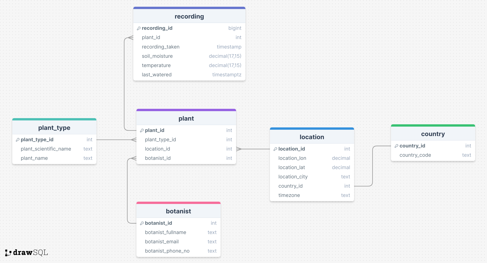
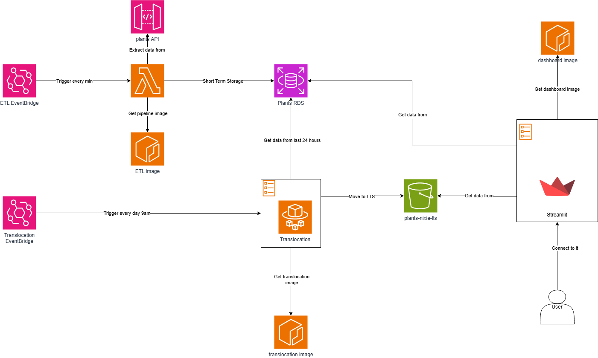

# Liverpool Natural History Museum Plant Monitoring System

## 🪴 Overview 
This is team Nixie's solution to monitor the health of the plants at the Liverpool Natural History Museum over time. This system works in tandem with a Rasbperry Pi API to collate and analyse data on the plants present at the botanical wing.

## Table of Contents
- [Installation](#installation)
- [Setup](#setup)
- [Running the pipeline](#running-the-etl-pipeline)
- [Pushing to the cloud](#cloud-hosting)
- [Documentation](#do)
- [License](#license)

## Installation
Clone the repository
```git clone https://github.com/fm1psy/c11-nixie-lnhm-project```
Move to the cloned repository
`cd c11-nixie-lnhm-project`
Install dependencies
`pip install -r requirements`

## Setup
Set up the database by running the script inside the pipeline directory
```bash connect.sh```

Depending on the service you wish to enable/use, you will be required to follow a few extra steps. These will be detailed in their respective `README.md` files.

## Running the ETL pipeline
The `pipeline` folder contains all of the documents needed for the ETL pipeline. This pipeline extracts the data from the plants API, cleans and transforms the data, then loads it onto a Microsoft SQL Server.

## Cloud hosting
### Terraforming
This solution uses terraform to automate the infrastructure needed to enable cloud hosting. It uses AWS as its cloud service provider, and will require you to follow these steps:
create

## Documentation
### ERD Diagram


### Architecture Diagram
